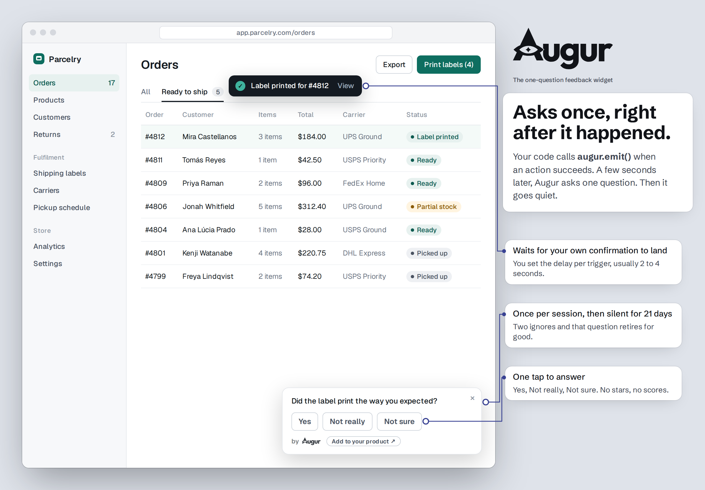
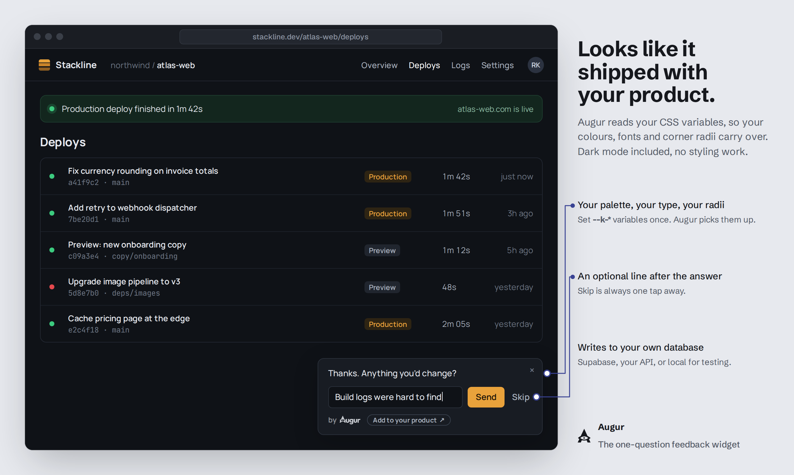
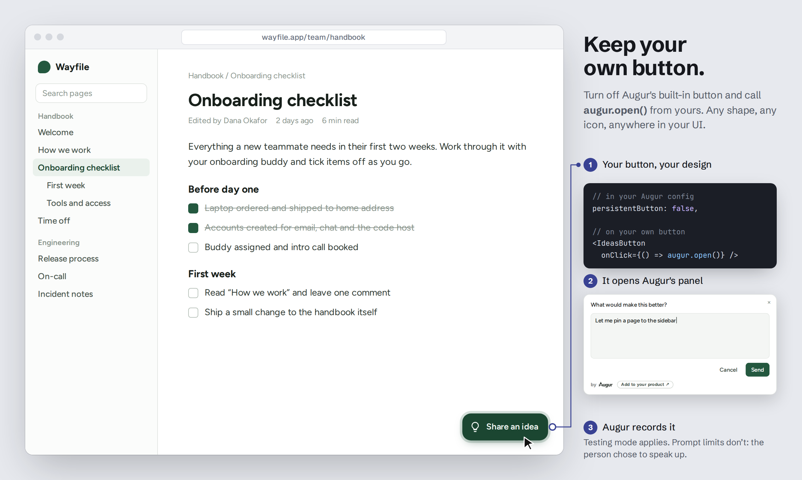
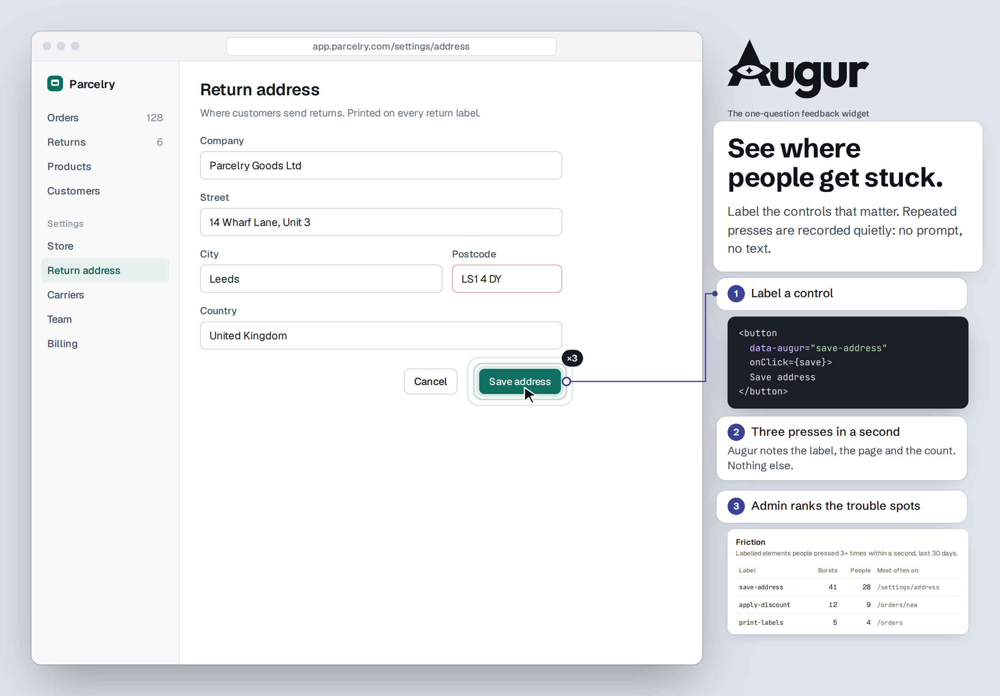

<div align="center">

# Augur

**In-app feedback for React apps.**
One well-timed question, three answers, an optional line. Your coding agent picks where it asks.

[](https://github.com/kaezee/Augur/actions/workflows/ci.yml)
[](./LICENSE)
[](./augur)

**[Try the live demo →](https://kaezee.github.io/Augur/)**

</div>

<p align="center">
  
</p>

Augur is in-app user feedback for React and TypeScript. It asks one question at a
real moment in your product (*"Was it easy to export that report?"*), takes one of
three answers and an optional line, then gets out of the way. It is not a form
builder, not an NPS widget, not a survey tool.
It exists to catch honest reactions at the moment they happen, without ceremony.

**Already have a help or bug button? Augur can be it.** Its feedback button opens a
small panel: *"What's on your mind?"* with Something broke / confusing / missing,
then a line. Use the built-in button, or keep your own and call `augur.open()` from
it (`persistentButton: false`). Both are supported, and both record the same way.

Distribution is **copy the folder**. No npm install, no build step, no service to
run. Drop `augur/` into your React app, pick where the data goes, mount it once.

**Works with** React 18+: Vite, Next.js (as a client component), Remix. The engine
(triggers, caps, stores) is plain TypeScript; only the visible layer is React.

---

## Three-step integration

**1. Copy** the [`augur/`](./augur) folder into your `src/`.

**2. Pick a store** — the one seam between Augur and your database:

| Store | Backend | Use |
|---|---|---|
| `LocalStore` | `localStorage` | demo / dev, single device |
| `SupabaseStore(client)` | Supabase | run [`sql/schema.sql`](./sql/schema.sql) once |
| `HttpStore({endpoint})` | your API | you implement the routes |

Or write your own to the `AugurStore` interface in [`augur/store.ts`](./augur/store.ts).

**3. Mount once and emit** — the whole integration is two lines:

```tsx
import { Augur, augur } from "./augur";

// declare the trigger in your config…
"checkout.done": { enabled: true, version: 1, delayMs: 3000,
  maxAsks: 1, dismissKill: 2, question: "Did that go through as expected?" }

// …mount once, high in the tree…
<Augur userId={session.user.id} store={store} config={MY_TRIGGERS} />

// …and emit where the action completes. Fire-and-forget; caps decide if it shows.
await placeOrder(cart);
augur.emit("checkout.done");
```

See [`example/usage.tsx`](./example/usage.tsx) for a complete file.

## Install with an AI coding tool

Paste this into Claude Code, Cursor, or your AI app builder:

```text
Add Augur (in-app feedback) to this app: https://github.com/kaezee/Augur
Read AGENTS.md in that repo first and follow it exactly. Audit this app and propose
where Augur should ask, and check the plan with me before you write any code.
If you can't open the link, stop and tell me.
```

Later, you can ask the same tool to turn Augur off, pause a prompt, or remove it.
AGENTS.md tells it how.

---

## What you get

- **Response types** — `choice3` (Yes · Not really · Not sure — the default, and the
  only one that rolls into the summary), `choice` (2–5 custom options), and `text`.
  Deliberately closed: no ranking, matrix, NPS, or star ratings. That is the line
  between a feedback prompt and a form builder, and Augur stays on the near side.
- **Caps, enforced locally** — one prompt per session, one per user per N days, quiet
  for N days after any answer, plus per-trigger lifetime and dies-after-N-ignores.
  Per-device and best-effort by design (no user history is ever read back); the
  analytics stay exact.
- **Testing mode** — a switch in admin that keeps every prompt visible so you can try
  the flow, while recording nothing: no events, no counts, no manual-button clicks. QA
  in testing, flip to live when you're ready, and your own clicks never skew the data.
- **Unconfigured emits are caught** — an `emit()` with no config entry is logged and
  surfaced in admin instead of vanishing silently, the most common integration slip.
- **Theme-aware, self-contained** — the snackbar reads your `--k-*` CSS variables
  with sane fallbacks, so it inherits your look and still renders fine where none
  are defined. No external assets, no fonts, no network.
- **Row-level security on by default** — the Supabase schema enables RLS on every
  table and routes admin reads through checked functions, so feedback isn't readable
  by anyone with your public key.
- **Bring your own button** — set `persistentButton: false` and call `augur.open()`
  from any control in your UI. Your design, Augur's prompt and logging.
  `augur.open("help-menu")` records where it was opened from; `augur.close()` closes
  whatever Augur is showing; `augur.onPanelState(open => …)` lets your button hide
  while Augur is on screen.
- **Categories on the button's panel** — `Something broke`, `Something's confusing`,
  `Something's missing` by default. Set your own (2 to 5, each `{ key, label }` with
  an optional `placeholder`), or `categories: []` for plain free text. Optional
  `moreLink: { label, href }` adds a quiet "Say more ↗" link. Categories are only
  for feedback people start themselves; triggered prompts keep their own question.
- **Diagnostic context with each button submission**, on by default, so a report is
  fixable. It collects places, never words:
  - the page path (`location.pathname` only: never the query string or `#` fragment,
    which often carry tokens and emails),
  - your app version, if you pass `appVersion` to `<Augur>`,
  - the window size, the browser's user agent, the time, where it was opened from,
    and a per-tab session id,
  - the last 5 uncaught errors, each as its type, script URL (query stripped), line
    and the first line of the message cut to 120 characters. Browser-extension errors
    are dropped, and so is any source you list in `ignoreErrorSources`.

  It never reads the page, form fields, or anything the person typed elsewhere.
  `context: false` turns it off entirely: no listeners, nothing sent.
- **Every string configurable** — `strings` covers each visible word (buttons,
  headings, placeholders, accessible labels) and merges per key, so you can
  override one without restating the rest. Translate `followup`, `manualQuestion`
  and the `answers` labels alongside it.
- **Friction, without asking** — label the controls that matter with
  `data-augur="save-entity"`. When someone presses the same labelled control 3 times
  within a second (the "is this thing working?" moment), Augur records it quietly:
  the label, the page path and the press count. No prompt, no element text, nothing
  typed, at most 20 per session. Admin shows which labels people fight with most.
  Unlabelled elements are never watched; `friction: false` turns it off.

  ```tsx
  <button data-augur="save-entity" onClick={save}>Save</button>
  ```
- **Accessible** — prompts are announced politely, triggered prompts never take focus, the
  panel takes focus when someone opens it and gives it back when it closes, Esc
  closes in every state, and every control has a visible focus ring.

<p align="center">
  
</p>
<p align="center">
  
</p>
<p align="center">
  
</p>

## Admin (optional)

Mount `<AugurAdminSection store={store} hostConfig={MY_TRIGGERS} />` behind your own
route and guard. Two tabs: **Results** (a plain-sentence summary, a per-trigger
table, and the notes) and **Settings** (reword questions and answer labels, tune caps
and timing, **Show preview** to see a prompt at real width — previews are never
counted — and a master switch). The route, the
admin check, and the 404 are yours — Augur ships the section, not the page.

Results also counts button submissions by category and by entry point, filters
notes by category, and shows each submission's context in plain words.

Skip the admin import entirely and collection still works, with a smaller bundle.

## Get told when feedback lands

Augur stores feedback; it doesn't page you. Admin shows the unread notes, but if
nobody opens it, a "this is broken" note can sit for weeks. Have the backend send you
a ping when a note is saved. It must come from the server: a webhook URL in browser
code is public.

Keep the ping short: the category, the screen, and a link to your admin. Put the
note itself, or who wrote it, in Slack or email only if your privacy notice says
feedback goes there.

**Supabase.** Dashboard → Database → Webhooks → *Create a new hook*: table
`augur_notes`, event *Insert*, type *Supabase Edge Function*. The function posts to
Slack (set `SLACK_WEBHOOK_URL` as a function secret):

```ts
// supabase/functions/augur-ping/index.ts
Deno.serve(async (req) => {
  const { record } = await req.json();                 // the new augur_notes row
  await fetch(Deno.env.get("SLACK_WEBHOOK_URL")!, {
    method: "POST", headers: { "content-type": "application/json" },
    body: JSON.stringify({ text: `New Augur feedback (note ${record.id}). Open admin to read it.` }),
  });
  return new Response("ok");
});
```

**Firestore** (your own adapter). A Cloud Function on the collection your adapter
writes to:

```ts
import { onDocumentCreated } from "firebase-functions/v2/firestore";
export const augurPing = onDocumentCreated("feedback/{id}", async (e) => {
  const d = e.data?.data();
  await fetch(process.env.SLACK_WEBHOOK_URL!, {
    method: "POST", headers: { "content-type": "application/json" },
    body: JSON.stringify({ text: `New feedback: ${d?.category ?? "general"} on ${d?.context?.route ?? "?"}` }),
  });
});
```

For email instead of Slack, have the function add a document to the `mail` collection
used by Firebase's *Trigger Email* extension.

**HttpStore.** Send the ping from your endpoint, after the note is stored.

If a ping per note is too much, run the same function on a schedule and send one
digest a day. Or ask your coding agent to go through the feedback each week: AGENTS.md
§6 covers it.

## For a beta

The default caps (one prompt per session, then 21 days of quiet) are right for a
shipped product, where asking too often costs goodwill. In a beta, people expect to
be asked, so you can tighten the loop:

```tsx
caps: { perSession: 1, perUserDays: 7, suppressAfterAnswerDays: 7 },
```

Go back to the defaults when you launch.

## Privacy

Augur has no server and calls nothing outside your app. Everything it records goes
to the store you chose: your Supabase project, your API, or the browser in local mode.

**What it records**

| When | What |
|---|---|
| A triggered prompt shows | the `userId` you pass, the trigger id and version, the time, then the outcome (answered / dismissed / ignored), the answer, and the optional line |
| Someone sends feedback from the button | the category, their line, the entry point, and the diagnostic context listed under [What you get](#what-you-get) (page path, app version, window size, user agent, time, per-tab session id, the last 5 uncaught errors) |
| A labelled control is pressed 3 times in a second | the `userId`, the `data-augur` label, the page path, the press count, the time |

It never reads page content, form fields or keystrokes, and sets no cookies. In the
browser it keeps prompt-cap counters in `localStorage` and a per-tab session id in
`sessionStorage`. Page paths keep `location.pathname` only, so the query string and
fragment are never stored.

**How long it's kept.** Until you delete it. Augur never deletes anything on its
own. Admin → Purge clears prompt events, submissions and friction older than the
number of days you pick, or all of it. Augur's rows are keyed by `user_id` with no
foreign key to your users table, so add them to your account-deletion path:

```sql
delete from augur_events       where user_id = :id;  -- notes cascade
delete from augur_unconfigured where user_id = :id;
delete from augur_friction     where user_id = :id;
```

**Before you ship it, consider:**

- **Say so in your privacy policy.** Name the feedback and its diagnostic context,
  and the friction notes (which are tied to a user). Augur collects places, never
  words, but a policy that says nothing about either is still incomplete.
- **Pick a lawful basis where one applies.** Under GDPR, volunteered feedback usually
  rests on consent. Diagnostic context and friction usually rest on legitimate
  interest (finding and fixing problems), which needs your own assessment and an
  opt-out route. This is a starting point, not legal advice.
- **Check what your paths contain.** If a path can hold personal data (for example
  `/users/jane@example.com`), set `context: false` and don't label controls on those
  pages. Paths that hold opaque ids are fine to keep, but say so in your policy.
- **Keep identifiers opaque.** Pass a random user id as `userId`, never an email, and
  never put personal data in a `data-augur` label: labels are stored as written.
- **Everything is switchable.** `context: false` attaches no context and installs no
  error listeners. `friction: false`, or simply no `data-augur` labels, records no
  friction. `enabled: false` stops prompts, the button and friction; error listeners
  follow `context` alone, so set both to `false` for nothing at all.

## Upgrading

Replace your `augur/` folder with the new one, then on Supabase run each migration
newer than the version you had, in order. They're additive and safe to rerun.

- **From 0.4 (current `main`):** [`sql/migrations/0.5.0.sql`](./sql/migrations/0.5.0.sql)
  (paged notes, store-side submission tallies, a date index).
- **From 0.3:** [`0.4.0.sql`](./sql/migrations/0.4.0.sql) (friction), then `0.5.0.sql`.
- **From 0.2:** [`0.3.0.sql`](./sql/migrations/0.3.0.sql), then `0.4.0.sql` and `0.5.0.sql`. The
  built-in button now opens the category panel; set `categories: []` to keep plain
  free text.

Your triggers keep working unchanged. See [CHANGELOG.md](./CHANGELOG.md).

## Attribution

Augur is MIT-licensed. Use it, change it, ship it, commercially or not.

Each prompt carries a small **"by Augur"** byline linking back here. It's on by
default, and it's how other builders find Augur. If it doesn't fit your product,
turn it off in code:

```tsx
<Augur userId={session.user.id} store={store} config={MY_TRIGGERS} byline={false} />
```

No license, no form, no asking. If you do switch it off, a mention in your credits
or changelog, or a star on this repo, is what keeps Augur free.

Your **feedback entry point** (the floating "Feedback" button and its icon) is yours
to restyle or replace. See [`branding/README.md`](./branding/README.md).

The name "Augur" and the eye-in-triangle mark aren't covered by the MIT license.
Fork freely; give your fork its own name. Details in [TRADEMARKS.md](./TRADEMARKS.md).

## Remove it

Delete the `augur/` folder, the one `<Augur/>` mount, your `emit()` calls, and drop
the tables. Nothing else references it.

---

## Design principles

1. **One question, one moment.** Sampling, not surveying.
2. **The three-way answer is for prompts the product initiates.** Free text is for
   prompts the user initiates (the persistent button).
3. **Never render a zero where nothing was measured.** A dash, not a `0`.
4. **Adding or removing a trigger is a code change**, because it needs an `emit()` in
   your source. Everything else — wording, caps, enable/disable — is tunable in admin
   without a deploy.

## License

[MIT](./LICENSE) © 2026 Krishnachandran Ramachandran ([kaezee](https://github.com/kaezee)).
Name and mark: [TRADEMARKS.md](./TRADEMARKS.md).

Issues are welcome; for pull requests, open an issue first ([CONTRIBUTING.md](./CONTRIBUTING.md)).
Report security problems privately ([SECURITY.md](./SECURITY.md)).
